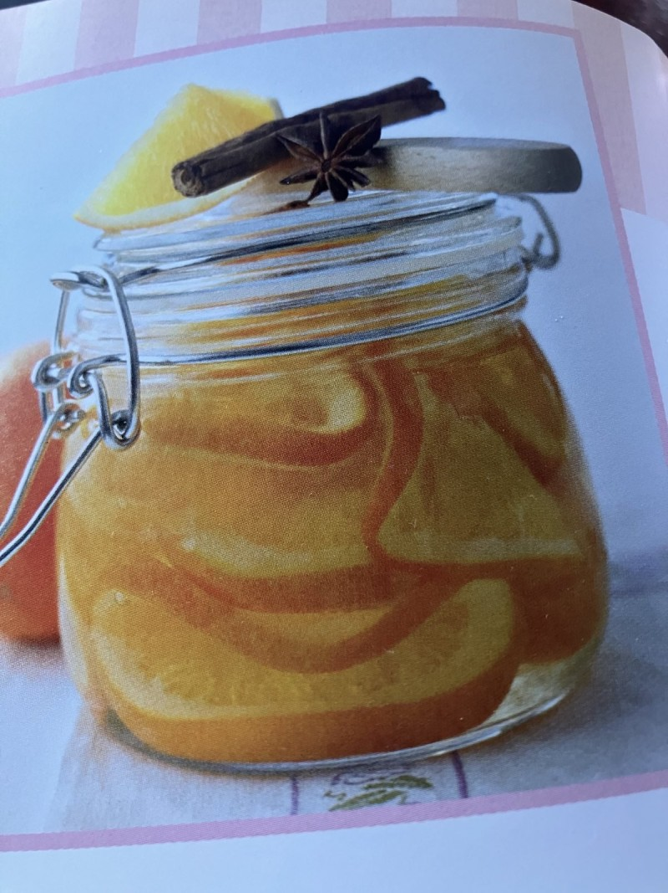

# Gewürzorangen

## Zutaten

Für 4 Gläser (a´500 ml)

- 8 kernlose Bio-Orangen
- 600ml Weißweinessig
- 900g Zucker
- 8 schwarze Pfefferkörner
- 2 Kardamomkapseln
- 2 Zimtstangen oder 2 Sternanis
- 1 Prise Macis (Muskatblüte)

## Zubereitung

1. Die Orangen heiß waschen, abtrocknen und mit einem scharfen Messer in etwa 5 mm dicke Scheiben schneiden. dabei die erste und letzte Scheibe jeder Orange wegwerfen.

2. Die Orangenscheiben in einen Topf geben und so viel Wasser dazugeben, dass die Orangen gerade bedeckt sind. Den Topf mit einem Deckel halb bedecken, zum Kochen bringen und bei geringer Hitze 1 Stunde köcheln lassen. Sobald die Orangen weich sind, in ein grobmaschiges Sieb abgießen und abtropfen lassen.

3. Essig und Zucker in einen Topf geben und erwärmen, bis sich der Zucker aufgelöst hat. Die Gewürze in ein Mullsäckchen oder Tee-Ei füllen, in den Topf geben, die Mischung zum Kochen bringen und 5 Minuten kochen lassen. Die Orangen dazugeben und zugedeckt weitere 20 Minuten köcheln lassen. Die Gläser sterilisieren.

4. Die Orangenscheiben mit einer Schaumkelle aus dem Sirup nehmen und in die vorbereiteten Gläser schichten. Das Gewürzsäckchen entnehmen, den heißen Sirup über die Orangen gießen und die Gläser verschließen. An einem kühlen Ort 4 Wochen durchziehen lassen.
   
   >**WECKGläser**, Gummiringe und Deckel vorbereiten:
   >
   >    Saubere und staubfreie Gläser mit kochendem Wasser (Wasserkocher) spülen und Gummiringe im Wasser liegen lassen. 
   >
   >    Wenn du neue Weckgläser verwendest, dann spüle diese mit sehr heißem Wasser und etwas Spülmittel aus oder stelle sie für einen Durchgang in die Spülmaschine. Die **Gummiringe** werden vor Verwendung ebenfalls mit kochend heißem Wasser und einem Spritzer **Essig** übergossen und bleiben dort zwei bis drei Minuten liegen. Anschließend in heißes Wasser (ohne Essig) geben und dort bis zur Verwendung liegen lassen.

5. Zum Einfüllen, das **Glas auf ein feuchtes Tuch** stellen, damit es durch das Einfüllen des heißen Kochgutes nicht platzt.

6. Einzukochendes einfüllen, etwa ein Fingerbreit Platz zum obersten Rand lassen.

7. Mit Gummis bestückte Deckel auf die Gläser legen und mit den Klammern verschließen.

8. Gläser auf ein tiefes .... Fettpfanne platzieren und diese mindestens halbhoch mit warmem Wasser füllen. Die Gläser dürfen sich nicht berühren!
   
   >Wer hier ein kochbares Geschirrtuch unterlegt, sorgt dafür, dass die Gläser nicht verrutschen.

9. Backblech in den Ofen schieben und Ofen auf 180 Grad Ober-/Unterhitze aufheizen.

10. Wenn die Temperatur erreicht ist, dauert es etwa 30 - 45 Min. bis sich in den Gläsern kleine Kochbläschen bilden.

11. Danach gilt bei
    - GEMÜSE: Ofen auf 150 Grad Umlauft zurückdrehen und für weitere 90 Minuten einkochen. Danach Ofen ausstellen und Gläser für weitere 30 Minuten darin satehen lassen.
    - FRÜCHTE: Ofen ausschalten und weitere 30 Minuten im heißen Ofen stehen lassen.

12. Gläser herausnehmen und auskühlen lassen,  danach erst die Klammern entfernen. (Vielleicht sogar einfrieren?!)

13. Sollten sich die Deckel leicht anheben lassen, dann hat das Vakuum nicht gegriffen. Dann hält sich der Vorrat dennoch ein paar Tage im Kühlschrank
