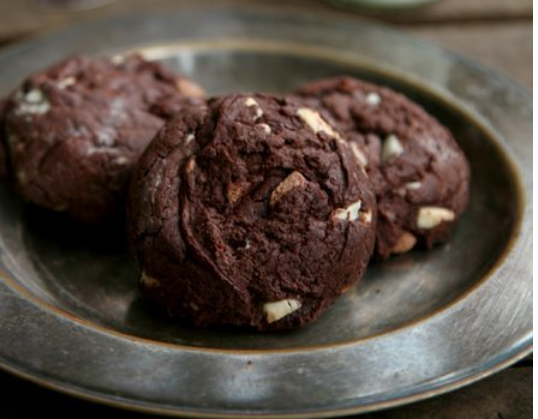

# Brownie

## Zutaten

- 500 g Butter
- 130 g Kakaopulver
- 8 Eier
- 4 Zucker Tassen
- 2 Mehl Tassen
- 2 Haselnuss Tassen
- 2 Pack. Vanillezucker

## Anweisungen

1. Haselnüsse mahlen
2. Butter erwärmen und mit Kakaopulver vermischen.
3. anschließend die restlichen Zutaten untermengen und auf ein gefettetes Backblech streichen.