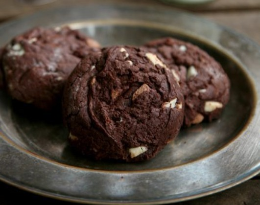

# Cookies

Zutaten

- 150 g Zartbitterschokolade gehackt
- 125 g Butter
- 210 g Mehl
- 60 g Kakaopulver
- 1/2 TL Natron
- 1/4 TL Backpulver
- 1/2 TL Salz
- 2 Eier Gr. L
- 100 g Zucker (90g)
- 75 g Muscovado (ohne) Vollrohrzucker
- 100 g weiße Schokolade gehackt
- 100 g Vollmilch/Noisette-Schokolade
- 1 EL Instantkaffee

Anweisungen

Ofen auf 170° C (Umluft) vorheizen, ein Backblech mit Backpapier auslegen (ohne es mit aufzuheizen).

Am besten jetzt schon die Eier mit dem Zucker schaumig schlagen …… auf jeden Fall den Schmetterling in den Thermomix ….ca. 12 Min.

Die Zartbitterschokolade mit der Butter in einem kleinen Topf schmelzen (an dieser Stelle auch das Espressopulver mit hinzugeben) und etwas abkühlen lassen. Mehl, Kakao Natron, Backpulver und Salz in einer kleinen Schüssel vermengen.

In einer Rührschüssel die Eier mit den beiden Zuckerarten schaumig schlagen (ca. 12 Min. mit dem Kenwood/Thermomix) (wie schon vorher erwähnt), anschließend die Schokoladen-Butter-Mischung hinzugeben. Nun die Mehlmischung vorsichtig unterarbeiten, bis die Masse sich gerade so verbunden hat. Nun vorsichtig die Schokoladenstückchen unterarbeiten.

Mit einem Eisportionierer Kugeln in ca. 5 cm Abstand auf das Blech setzen und die Kekse für 10 Minuten auf der zweiten Schiene von unten backen. 10 Minuten auf dem Blech und schließlich vollständig auf einem Kuchengitter auskühlen lassen.
